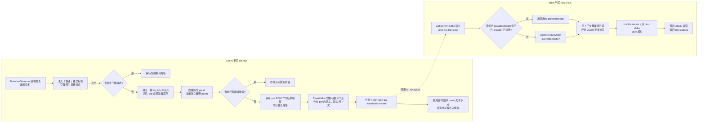

# Plan for: "轨迹检查器「AI 翻译」标签插件（@local/traj-translate）"

## 问题陈述

Web GUI 的「轨迹」视图记录检查器（概述/预览/原始内容）没有官方插件 Slot，无法用官方方式加标签；同时客户端没有任何可直接调用模型的 Remote（`ctx.remote.llm` 只有元数据方法）。需要一个插件，在检查器标签栏注入「翻译」标签，把记录的**「原始内容」**（主要诉求：看 AI 的思考过程）翻译为简体中文，结构不变，无上下文。

## 需求（含用户原话决策）

- [1] 翻译对象＝「原始内容」标签的内容（用户："我主要想看ai是怎么思考的来着"）。记录没有「原始内容」标签时（如工具调用记录），回退翻译当前激活标签内容。
- [2] 翻译模型＝当前默认模型，**每次翻译时动态读取**，不硬编码（用户："记得不同会话不同模型啊"）。增强：当概览面板可见「提供方/模型」信息时，客户端提取 provider/model 提示随请求发送，Host 校验该 provider 已注册后优先使用；否则回退 `agentDefaultModel.currentSelection()`。
- [3] 代码、命令、路径、URL、JSON 键名、标识符**保留英文原样**（用户选 a）。
- 目标语言固定简体中文；无上下文（每批独立请求，不带会话历史）；结构完全保留（只换文本节点，DOM 结构不经模型）。
- 插件可随时禁用/卸载，卸载后界面完全还原。

## 背景（调研发现，均已读源码确认）

- 检查器标签列表硬编码于 `@deepseek-ai/dsh-client-ui-trajectory`（`detailTabs()` L4568+、标签渲染 L6183）；原生标签按钮 id 形如 `trajectory-detail-raw`，面板固定 id `trajectory-detail-panel`——稳定的 DOM 锚点。
- 原始内容标签按内容块顺序渲染 thinking/text/tool-call 等（`MarkdownRecordContent`，L6524），正对应用户"看 AI 怎么思考"的诉求；原始内容仅在 raw 标签激活时渲染于 DOM。
- Host `ctx.llm.stream({provider, model, messages})` 是官方模型调用路径，chunk 协议 `{type:'text-delta',text}` / `{type:'finish'}`；`ctx.agentDefaultModel.currentSelection()` → `{provider, model}`。
- 插件 Host 半区可 `ctx.webServer.register({kind:'prefix', path, handler})` 注册同源路由（`/plugins` 即此机制），页面直接 fetch，无 CORS、无需 typert 编解码。
- 本机已验证的本地插件安装范例：`@local/skills-panel`（package.json `dsh.client` + `cordis.patch.yml` insert patch，经 plugin_manager 安装为 bundle）。
- 原始内容可能很长：分批（≤40 段或 ≤6000 字符/批）顺序请求；会话内缓存避免重复消耗。
- 早期调研产物 `traj-translate/design/plan.md` 内容已并入本计划，执行阶段删除该文件。

## 方案

关键决策：

1. **结构保持＝独立 Tab + 独立翻译面板 + 1:1 克隆原貌**：
   - 顶部 tablist 注入独立「翻译」标签（`#trajectory-detail-translate`）；
   - 在 `#trajectory-detail-panel` 同级挂载独立 `#trajectory-detail-translate-panel`；
   - 激活「翻译」时，原生 panel 隐藏，翻译 panel 显示；克隆自「原始内容」DOM 结构，样式、排版、滚动条 100% 保持；
   - 原生「原始内容」面板**完全不变**，原汁原味英文随时可切回查看。
2. **文本提取修复（思考未翻译根因）**：
   - 「原始内容」的 thinking 和 text 全部在 `<pre className="...sourceBlockContent">` 中；
   - 彻底解除对 `pre` 和 `code` 的过滤拦截；
   - 过滤纯中文/纯标点（`!/[a-zA-Z]/.test(...)`），极大节省 token 且提速；
   - 超长段落（>2500 字符）智能拆分，避免超过单次 Prompt 限制。
3. **原生 Tab 与翻译 Tab 互不干扰**：
   - 点击原生 tab（概述/预览/原始内容）时，自动隐藏翻译 panel，恢复原生 panel，退出翻译高亮；
   - 切换记录时自动重置状态。

## 实施说明（v1.2 验收反馈修复）

1. **思考英文未翻译（根因已修）**：
   - 根因：`collectTextNodes` 中 `parent.closest('pre, code, ...')` 将 `<pre>` 一刀切过滤。而 raw 内容中所有思考与正文皆在 `<pre className="sourceBlockContent">` 内，导致思考内容完全未提取。
   - 修复：允许 `pre` 内正文提取，排除仅限 UI 按钮与隐藏元素；并优化跳过纯中文节点。
2. **交互形态重构为独立 Tab（符合预期）**：
   - 废弃原地覆盖原 DOM 的开关模式；
   - 引入独立 `#trajectory-detail-translate-panel` 与 `#trajectory-detail-translate` 标签；
   - 点击「翻译」：渲染与「原始内容」排版一致的中文页面；
   - 点击「原始内容」：原汁原味英文原状展现，互不污染，双向秒切。

---
**最后更新：** 2026-02-27
**作者：** AI（DeepSeek）& User
**版本：** v1.2
