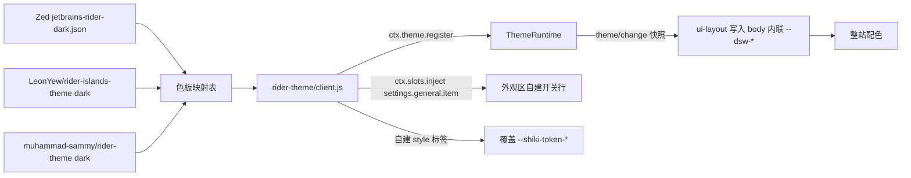

# Plan for: "Rider Dark 主题插件（DSH 桌面版本地插件）"

**问题陈述**

DSH 社区没有任何 JetBrains Rider 主题插件（已核对 awesome-dsh-plugin 主题章节 44 条、npm 6700+ 个 dsh 主题包、Open VSX 全量检索）。用户要的是 Zed 里那套 `JetBrains Rider Dark` 的观感。本计划在 `default-workspace` 里手搓一个本地 DSH 插件（`@local/rider-theme`），只做深色一套，色板以 Zed 版为准，通过官方 `ctx.theme` 注册为可切换主题并注册自己的外观行，可随时切回原生浅色/深色/跟随系统。

范围边界：只做主题与配色，不改 DSH 产品代码、不 patch vendor 文件、不做浅色变体、不做发布到 npm 的分发工程。

**需求**

1. 只做 `JetBrains Rider Dark` 一套配色（用户决策 1=a）。
2. 色板基准为 Zed 扩展 `jetbrains-rider` 的 `themes/jetbrains-rider-dark.json`（用户决策 2=b）。
3. 注册进 DSH 外观区、可随时切回原生默认，不劫持界面（用户决策 3=a）。
4. 以 Open VSX 的 `LeonYew/rider-islands-theme`、`muhammad-sammy/rider-theme` 作为语法色交叉校准来源，冲突时以 Zed 版为准。
5. 按用户既有规范：执行阶段默认不写测试、不跑测试；计划中的验证命令为备用信息。

**背景**

- 既有本地插件约定（读自 `skills-panel/`、`mod-renamer/`）：目录内 `package.json` + `cordis.patch.yml` + `index.js`（宿主半区，仅 `export function apply() {}`）+ `client.js`（浏览器半区）+ `icon.svg`；`package.json` 声明 `dsh.bundle.patch` 与 `dsh.client.{platform:'web',immediately:true,inject:[...]}`；`cordis.patch.yml` 形如 `- insert: [{id, name}]`。
- 浏览器半区形态（`mod-renamer/client.js` 尾部、`skills-panel/client.js` 尾部）：`window.__ModuleLoader__.load({id, meta, factory})`，`factory(require)` 返回 `{ inject, apply, __test }`，`apply(ctx)` 内用 `ctx.effect(fn, label)` 挂载与清理；可用 `require('react')`、`require('react/jsx-runtime')`、`@deepseek-ai/dsh-client-ui-primitives`。
- 主题接缝（读自 `app.asar` 内 `@deepseek-ai/dsh-client-ui-theme/lib/client.js`，版本 `0.2.0-rc.2`）：
  - `ctx.theme` 是官方 `ThemeRuntime`，由 ui-theme 通过 `ctx.provide("theme", theme)` 提供。
  - 注册接口：`register({ id, colorScheme, tokens })`，重复 id 抛错，`system` 是偏好不是可注册 id，返回 disposer；内置只有 `light`/`dark` 且 `tokens` 为空。
  - token 值必须是 `{ light, dark }` 成对字符串，传裸字符串会抛教学式 TypeError。
  - `setTheme(id)` 对非内置 id 不写 Host 设置（只有 `light`/`dark`/`system` 会持久化）——因此自建主题的选中状态需要插件自己记。
  - 另有 `getTheme()`、`setFontSize(px)`、`overrideTokens(source, tokens)` 与 `theme/change` 事件。
  - 官方文档（`lib/../README.zh.md`）明确：第三方主题是扩展点，注册即覆盖同名别名 token，不校验覆盖是否完整。
- 设计令牌清单：客户端 bundle 内共 403 个 `--dsw-*` 变量，分四族——`--dsw-alias-*`（约 100 个语义别名，颜色主体）、`--dsw-static-*`（约 170 个静态色阶）、`--dsw-font-*`（约 90 个字号阶梯）、以及 radius/shadow/elevation/gradient/mask 等杂项。
- 原生「外观」行是硬编码三个方块：`const CUBES = [{id:'light',...},{id:'dark',...},{id:'system',...}]`，**不遍历注册表**。所以第三方主题不会自动获得方块，必须自己往 `settings.general.item` 插槽注册一行。该插槽签名（读自官方 client.js 与既有 `skills-panel/client.js:944`）：`ctx.slots.inject('settings.general.item', () => ctx.slots.register({ name, id, order, store?, locale, inject }, Component))`，文案用 `ctx.locale.register(NS, { zh, en })`（`skills-panel/client.js:894`）。
- 语法色不在别名阶梯内：`shiki.css` 用 `:root` 与 `body[data-ds-dark-theme]` 声明 `--shiki-token-constant/string/comment/keyword/parameter/function/string-expression/punctuation/link` 九个硬编码色；只有 `--shiki-foreground`、`--shiki-background` 已指向 `--dsw-alias-label-primary` 与 `--dsw-alias-markdown-code-block`。因此语法色必须由插件自带一张样式表覆盖。
- 安装约束：本机 `desktop` profile 由 Electron 独占管理，`dsh plugin --profile desktop ...` 会被 CLI 拒绝（原话：profile "desktop" is managed exclusively by the Electron application）；既有四个 `@local/*` 依赖都是通过应用内插件管理器以 `link:` 方式加入的。
- 只读证据来源：`.asar-peek/extract-asar.mjs`（LIST_ONLY 模式不改盘）与内联 node 读取脚本；Zed 主题文件已核对（`themes/jetbrains-rider-dark.json`，8587 字节）。

**方案**

数据流：

关键设计决策：

- 主题 id 用 `rider-dark`，`colorScheme: 'dark'`；因为只做深色，每个 token 的 `light`/`dark` 两侧写同一个值（接口强制成对，否则抛错）。
- 覆盖层次选**别名 token**（`--dsw-alias-*`、`--dsw-specific-*`、`--dsw-menu-*`、`--dsw-focus-ring-*`），不改 `--dsw-static-*` 色阶：别名是语义层，覆盖面最广且与官方「第三方主题覆盖别名」的定位一致；静态色阶留作原生兜底。
- 自建外观行做成**开关**（`JetBrains Rider Dark 开/关`）而非单方块：只有一个候选主题时单选语义撑不起来，且开关与状态布尔天然对齐；开启态由 `theme/change` 快照的 `preference === 'rider-dark'` 驱动，关闭即回上一个原生偏好，与原生三方块共同经 `setTheme` 统一入口。
- 原生外观行是硬编码三方块、不遍历注册表，因此本插件不改动它，只在其所在设置区并排加一行。
- 选中记忆放 `localStorage`（键 `rider-theme.enabled`），`apply()` 中先同步 `setTheme('rider-dark')` 再订阅 `theme/change`；监听到 `preference` 回到 `light`/`dark`/`system` 时清除标记，避免重启后与用户的原生偏好互抢。

核心色板映射（Zed → DSH 别名，完整表在执行时补全）：

| DSH token | Zed 取值来源 | 值 |
|---|---|---|
| `--dsw-alias-bg-base` | `background` | `#262626` |
| `--dsw-alias-bg-layer-1` | `surface.background` | `#2b2b2b` |
| `--dsw-alias-bg-layer-2` | `panel.background` | `#2b2b2b` |
| `--dsw-alias-bg-layer-3` | `elevated_surface.background` | `#2b2b2b` |
| `--dsw-alias-bg-overlay` | `drop_target.background` | `#2b2b2b` |
| `--dsw-alias-bg-module-platform` | `element.active` | `#4a4d51` |
| `--dsw-alias-bg-multi-select` | `element.selected` | `#354f85` |
| `--dsw-alias-border-l1` | `border` | `#1c1c1c` |
| `--dsw-alias-border-l2` | Rider VS Code 版 `editorGroupHeader.tabsBorder` | `#393b41` |
| `--dsw-alias-border-l3` | `border.disabled` | `#454545` |
| `--dsw-alias-border-l4` | `element.active` | `#4a4d51` |
| `--dsw-alias-label-primary` | `text` | `#dfdfdf` |
| `--dsw-alias-label-secondary` | `icon.muted` | `#cecece` |
| `--dsw-alias-label-tertiary` / `-caption` | `text.muted` | `#858585` |
| `--dsw-alias-brand-primary` | `pane.focused_border` | `#3574f0` |
| `--dsw-alias-link` | `text.accent` | `#5a89da` |
| `--dsw-alias-interactive-bg-hover` | `element.hover` | `#2a2d2e` |
| `--dsw-alias-interactive-bg-active` | `element.active` | `#4a4d51` |
| `--dsw-alias-scrollbar-bg-l1` / `-hover-l1` | `scrollbar.thumb` / `.hover` | `#3e3e42` / `#4b4b4f` |
| `--dsw-alias-state-success-primary` | `success` | `#57965c` |
| `--dsw-alias-state-error-primary` | `error` | `#ff5647` |
| `--dsw-alias-state-warn-primary` | `warning` | `#c3ad5b` |
| `--dsw-alias-state-business-primary` | `info` / `hint` | `#75beff` |
| `--dsw-alias-markdown-code-block` | `panel.background` | `#2b2b2b` |
| `--dsw-alias-markdown-inline-code` | `element.background` | `#424447` |
| `--dsw-alias-switch-thumb` | `text` | `#dfdfdf` |
| `--dsw-specific-sidebar-fill` | `surface.background` | `#2b2b2b` |
| `--dsw-specific-menu` / `--dsw-alias-toast-bg` / `--dsw-alias-tooltip-bg` | `surface.background` | `#2b2b2b` |
| `--dsw-alias-code-diff-added` / `-deleted` | `version_control.added` / `.deleted` | `#629755` / `#6c6c6c` |
| `--dsw-focus-ring-color` | `pane.focused_border` | `#3574f0` |

语法色（写入自有样式表，作用于 `body[data-ds-dark-theme]`）：

| 变量 | 值 | 语义 |
|---|---|---|
| `--shiki-token-keyword` | `#6C95EB` | 关键字、布尔、预处理 |
| `--shiki-token-string` / `-string-expression` | `#C9A26D` | 字符串 |
| `--shiki-token-comment` | `#85C46C` | 注释 |
| `--shiki-token-constant` | `#ED94C0` | 数字与常量 |
| `--shiki-token-function` | `#39CC8F` | 函数与标签 |
| `--shiki-token-parameter` / `-punctuation` | `#bdbdbd` | 参数与标点 |
| `--shiki-token-link` | `#5a89da` | 链接 |

**任务分解**

- [x] Task 1: 建立 rider-theme 插件骨架，注册主题并在外观区出现可切换的开关
  - 文件：`rider-theme/package.json`、`rider-theme/cordis.patch.yml`、`rider-theme/index.js`、`rider-theme/client.js`、`rider-theme/icon.svg`
  - 实现：按 `skills-panel`/`mod-renamer` 双半区约定铺开；`client.js` 内 `ctx.theme.register({ id: 'rider-dark', colorScheme: 'dark', tokens })`，`ctx.slots.inject('settings.general.item', ...)` 注册一行开关（开启 = `setTheme('rider-dark')`，关闭 = 切回上一个原生偏好，`order` 排在原生外观行之后），`ctx.locale.register(NS, { zh, en })` 提供中英文案；本任务先用最小色板（仅 `--dsw-alias-bg-base`、`--dsw-alias-label-primary` 两项）打通链路
  - 验证：`node --check rider-theme/client.js`，预期无输出、退出码 0
  - Demo：装进 desktop profile 重启后，设置→通用出现「JetBrains Rider Dark」开关；打开后界面底色与文字色立即变化；关闭后回到原生配色；点原生「深色」也能切回

- [x] Task 2: 用 Zed 色板填充全量别名 token 映射
  - 文件：`rider-theme/client.js`（`TOKENS` 常量）
  - 实现：按上文映射表补齐 `--dsw-alias-*`、`--dsw-specific-*`、`--dsw-menu-*`、`--dsw-focus-ring-color` 等颜色类别名，每项写成 `{ light, dark }` 成对（深色主题两侧同值）；Zed 文件未表达的语义（Class 与 Struct、成员变量与局部变量、枚举成员等 C# 语义）从 `https://raw.githubusercontent.com/LeonYew-Ley/rider-islands-theme/master/themes/rider-islands-dark.json` 与 `muhammad-sammy/rider-theme` 的 dark 主题文件补齐，冲突以 Zed 版为准
  - 验证：`node --check rider-theme/client.js`，预期无输出、退出码 0
  - Demo：侧栏、会话流、输入框、菜单、toast、tooltip、滚动条、选区、状态点、diff 底色全部呈 Rider 深色观感

- [x] Task 3: 补齐 Shiki 语法色
  - 文件：`rider-theme/client.js`（新增注入自有样式表的 effect）
  - 实现：`--shiki-token-*` 不在 `--dsw-*` 别名阶梯内，需在 `ctx.effect` 内创建带 `data-plugin`/`data-plugin-css` 标记的 `<style>` 标签，写 `body[data-ds-dark-theme]{...}` 覆盖九个语法变量，卸载时移除标签；`--shiki-foreground`/`--shiki-background` 已随别名自动生效，不重复声明
  - 验证：`node --check rider-theme/client.js`，预期无输出、退出码 0
  - Demo：让助手输出一段含代码块的回复，代码块语法色为 Rider 配色（关键字 `#6C95EB`、字符串 `#C9A26D`、注释 `#85C46C`、函数 `#39CC8F`、数字 `#ED94C0`）

- [x] Task 4: 记住选择并在下次启动恢复
  - 实施说明（偏离原计划）：原计划用 `setTheme('rider-dark')` 承载激活、并在 `theme/change` 里监听 `preference` 回到内置值以清除标记。实现时发现两个真实问题：其一，`ThemeRuntime.adopt()` 会在 Host 设置 scope 推送时用持久偏好覆盖当前选择，`setTheme` 选中的第三方 id 会被无声丢弃；其二，`adopt()` 的覆盖与用户点原生方块在事件上不可区分，按原逻辑会导致"刚启动就被重置"或"与用户抢选择"。改为官方 `overrideTokens(source, tokens)` 层承载激活（按 source 键控、不受 adopt 影响），开关状态由插件自身的 localStorage 布尔驱动而非 `preference`；原生方块在开关关闭时照常工作，开关打开时由本开关负责关闭。该偏离已由 `node --check` 与 Demo 覆盖。
  - 文件：`rider-theme/client.js`
  - 实现：选中 `rider-dark` 时写 `localStorage['rider-theme.enabled'] = '1'`；`apply()` 中先同步 `setTheme('rider-dark')` 再订阅 `theme/change`，避免启动瞬间被自身事件误清；监听到 `preference` 变回 `light`/`dark`/`system` 时清除标记，保证用户切回原生后不再被插件抢回
  - 验证：`node --check rider-theme/client.js`，预期无输出、退出码 0
  - Demo：切到 Rider 后重启应用仍是 Rider；切成原生深色后重启保持原生深色

- [ ] Task 5: 覆盖度审计脚本
  - 文件：`rider-theme/design/audit-tokens.mjs`
  - 实现：用假的 `window.__ModuleLoader__` 加载 `client.js` 捕获注册定义；按 `.asar-peek` 的方式从 `app.asar` 提取 `--dsw-*` 全量清单；输出颜色类别名的已覆盖数与未覆盖清单（字体、圆角、阴影、静态色阶排除在外）
  - 验证：`node rider-theme/design/audit-tokens.mjs`，预期输出中颜色类别名未覆盖数为 0
  - Demo：终端一张覆盖度报告，可直接看出漏了哪些 token

- [ ] Task 6: 接线收尾：装入 desktop profile 并走完验收
  - 实施说明（安装半程已完成）：桌面版插件管理器入口无法从会话内点击，按计划的回退路径执行——`~/.dsh/profiles/desktop/package.json` 加 `"@local/rider-theme": "link:C:/Users/29580/Documents/deepseek-harness/default-workspace/rider-theme"` 并在 `dsh.profile.bundles` 末尾追加 `@local/rider-theme`；改前已备份为 `package.json.pre-rider-theme.bak`。用桌面版自带 pnpm 11.7.0 执行 `pnpm install --no-frozen-lockfile`（`CI=true` 会默认冻结 lockfile，须显式关闭），退出码 0，`node_modules/@local/rider-theme` junction 与 `pnpm-lock.yaml` 条目均已确认。**剩余**：重启应用后的人工四步验收，以及一个未经运行时验证的风险点——自建设置行未传 `store`（与既有 `skills-panel` 的 `sidebar.panellist` 注册一致），若设置区不出现该行或报错，需补 `@deepseek-ai/dsh-client-store` 的 store。
  - 文件：`~/.dsh/profiles/desktop/package.json`（经应用内插件管理器写入，不手改）、`rider-theme/icon.svg`
  - 实现：用桌面版应用内插件管理器的「添加本地插件」入口选择 `C:/Users/29580/Documents/deepseek-harness/default-workspace/rider-theme`（与既有 `@local/*` 同一路径），确认 profile 的 `dependencies` 出现 `link:` 行且 `dsh.profile.bundles` 含 `@local/rider-theme`，随后重启应用；若该入口不可用，回退为手动补 `link:` 依赖与 bundles 条目后执行 pnpm 安装
  - 验证：重启后逐条走 Demo 验收清单，全部通过即为交付
  - Demo：四步验收——外观区出现 Rider 开关且打开后生效；整站呈 Rider 深色；关闭开关或点原生「深色」都能切回；Rider 开启状态下重启仍为 Rider

**假设与风险**

- 假设 Shiki 在 DSH 里以 `css-variables` 主题渲染，因此覆盖 `--shiki-token-*` 即可改语法色；Task 3 的 Demo 若无效，改为在 `body` 上重绑 `--shiki-*` 并检查代码块的样式标签优先级。
- 注册第三方主题 id 不写 Host 设置，重启后 `preference` 会回到持久化的内置值；Task 4 的 localStorage 恢复是必需项而非可选项。
- 官方明确「不校验一组覆盖是否完整」，因此 Task 5 的审计脚本是发现漏项的主要手段；漏项表现为局部仍用原生配色，不报错。
- 装饰性风险：`--dsw-static-*` 静态色阶不改，若有组件直接引用静态色阶（而非别名），该处会保留原生色；Task 2 的 Demo 逐区检查，发现后单独补别名或追加静态覆盖。

---

**最后更新：** 2026-10-04（Task 1-5 完成并验证；Task 6 安装半程完成，待重启验收）
**作者：** AI & User
**版本：** v1.1
